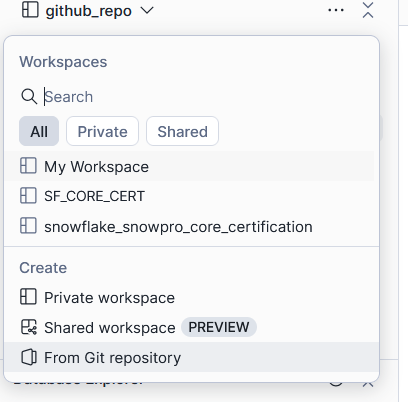
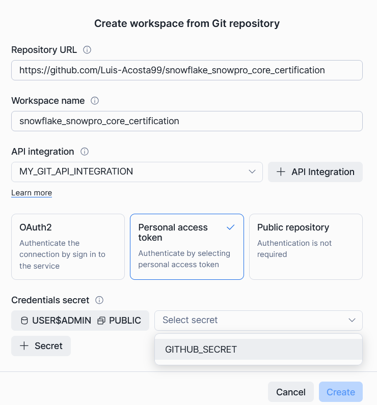
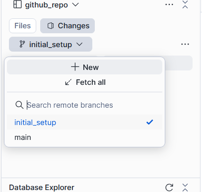

# Snowflake Snowpro Core Certification
>Repo for the excercises leading up to snowpro core certification exam.

## Snowflake - Github integration
In order to set up a workspace in snowflake that has an integration to a github-hosted repository, you have to follow a specific set of steps. This integration will allow you to develop projects in snowflake that can be synced and pushed to feature branches in a remote repository.

First, use the script "create_api_integration.sql" to generate the two objects therein contained in your snowflake schema. This will create the secret object, along with the api integration object. You can obtain the **PAT (Personal Access Token)** follwoing this tutorial:

Lastly, Create a Snowflake workspace from github:

Select PAT authetication and send the secret you created before:

Create a new branch:

And thats it! You're all set to go :\)